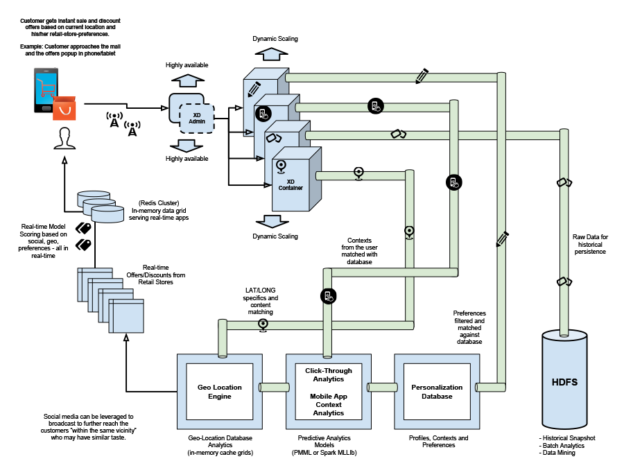
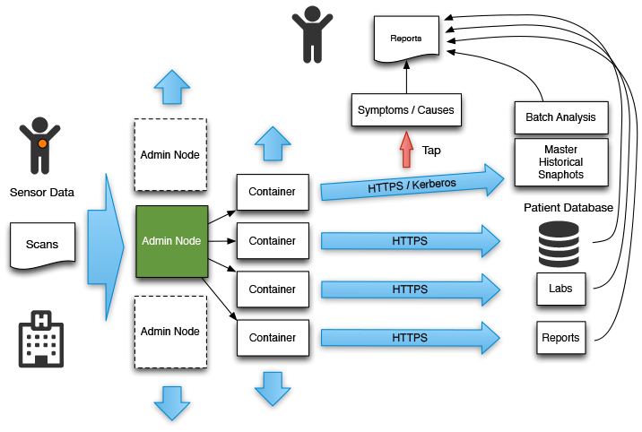
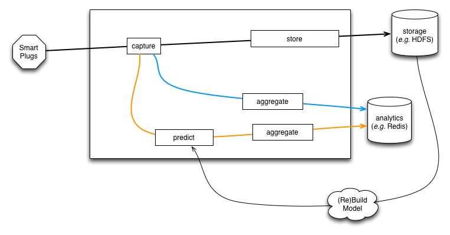

# Spring XD Architectures and Use Cases

	
<a href="#toc_1"><i class="fa fa-phone fa-fw"></i>Telco Services</a>

	
<a href="#toc_7"><i class="fa fa-heart fa-fw"></i>Health Care Services</a>

	
<a href="#toc_13"><i class="fa fa-bolt fa-fw"></i>Energy Services</a>

	
<a href="#toc_19"><i class="fa fa-music fa-fw"></i>Music Services</a>

	
<a href="#toc_25"><i class="fa fa-sun-o fa-fw"></i>Agriculture Services</a>

	
<a href="#toc_31"><i class="fa fa-plane fa-fw"></i>Airline Services</a>

## Telco Services

### Purpose
Contextually clever services that adapt to customer preferences along with geo-location into the mix improve operational efficiency.

### Use Case
Telco service providers would like to be equipped with data platform to learn from the data trends in order to make decisions. This enables them to address areas such as churn, services, or create new revenue streams.

### Problem
Growing addition to network protocols, data formats, and the need to generate context specific customer outcomes in real-time is very challenging.

### Solution
The data integration adapters in Spring XD allow subscription of various data sources. Equally seamless is to transform the individual payload into a desired data format. As the data is in transit, context specific data fragments can be computed through rich machine learning algorithms either through PMML models or via data processing engines such as Spark. Delegating the computation to Python is another alternative. 

### Outcome
Spring XD equips data scientists to collaborate seamlessly with Big Data Engineers and Application Developers.

## Health Care Services

### Purpose
Data from historical health records, lifestyle changes and genetics – all relevant to proactive outbreak study and to use as patterns for symptom diagnosis and medical treatments.

### Use case
Medical professionals would like to get access to historical data in order to combine with current patient vitals to diagnose and prescribe informed treatment procedures. Given that information is readily available, medical professionals would like to use the "actual" data points so that they can quantify and qualify.

### Problem
Digital collection, storing and analysis of health records are cumbersome and equally challenging is protecting patient health records.

### Solution
Data pipelines in Spring XD are designed to isolate data movement and at the same time protect the information through enterprise-grade security features such as SSL handshakes, LDAP and Kerberos. Spring XD can be used to collate data from various client endpoints (ex: medical implants, hospital devices, HL7 standards, clinical equipment), store them in easily accessible data-marts, and run analytics to compute real-time predictions.

### Outcome
Spring XD simplifies data collection and at the same provides fixtures to protect sensitive patient health information.

## Energy Services

### Purpose
Automation is critical for saving energy. Computerized electric utility grids yield immediate benefits through centralized monitoring and management of connected-devices.

### Use case
Energy service providers would like to proactively monitor and react to failure conditions as quickly as possible. They also would like to forecast utilization in order to be equipped for efficient energy consumption. Under failure scenarios, service providers would like to dispatch maintenance units and orchestrate the resolution lifecycle rapidly.

### Problem
Consuming data from various data devices is challenging and equally cumbersome is to make sense out of the data.

### Solution
Spring XD provides out of the box data integration adapters to connect with data producing “things”. As the data is in the pipeline, Spring XD also provides fixtures for data wrangling so that the data can be cleansed, transformed and analyzed. Energy services providers are now equipped with rich platform to handle both online and offline data that can be used for data mining to produce predictive analytics models. The models can be introduced back in the data pipeline using workflows to perform real-time predictions.

**Sample**

Spring XD provides a [sample](https://github.com/spring-projects/spring-xd-samples/tree/master/smartgrid-prediction) illustrating a solution approach in the context of electricity metering and production.

In this sample smart plugs are used to measure power consumption and reporting those metrics to the system. A use-case-specific UI provides simple dashboarding capabilities.  

### Outcome
Spring XD provides fixtures for real-time predictions based on usage patterns and historical trends. Given the unified approach towards handling and analyzing data, Spring XD automates workflows to reduce manual intervention.

## Music Services

### Purpose
Growing music delivery platforms and trendy wearables are disrupting the way we consume music. At the same time, it creates room for more innovation.

### Use case
Music streaming providers would like to create a data-centric platform to engage consumers through persona and context characteristics.

### Problem
Attracting customers to a music platform by itself is one big challenge; retaining and engaging them with personalized services can get even more challenging.

### Solution
Individual persona characteristics can be derived from preferences, interests and recommendations. Contexts can be past listening trends, favorite music artist, and rating on an album/song. It can also be a counter on number of times a song was played - it’s just another data point. Using Spring XD, real-time pipelines can be created to compute taste and preferences to deliver real-time recommendations. Spring XD’s REST APIs can be leveraged to seamlessly interface with wearables to publish and listen to events.

### Outcome
The out of the box adapters in Spring XD allows seamless interaction with ‘connected devices’.

## Agriculture Services

### Purpose
Better crop quality and optimized yields lead to sustainable energy and stronger economy.

### Use Case
Agribusiness providers would like to have a common data-exchange platform so that they can remain connected with various service providers (ex: weather station, seed and fertilizer suppliers, machinery providers, and laboratories) to efficiently manage supply and demand.

### Problem
Agribusiness providers run their own supply and demand workflows. It’s often handled manually and it’s error prone. Interconnection between providers requires everyone connected to a common platform in order to automate workflows. However, there exist numerous challenges to build one-stop-shop for all the data that can be accessible at anytime from anywhere.

### Solution
A data pipeline for each interconnected data-producing agents (ex: weather units, laboratories), enables easy collection of varied data sources. Spring XD can be used to consume both structured and unstructured data fragments. Once the data is in the pipeline, the out of the box analytics methods can be applied to compute predictions. The predictive models can be used for forecasting to enhance the overall agribusiness value chain.

### Outcome
Creating a data-exchange platform in Spring XD is straightforward. The ability to rapidly operationalize reliable data pipelines contributes to efficient data analysis and in turn better supply and demand management.

## Airline Services

### Purpose
Data influenced business decisions enable airline service providers to benefit from increased customer loyalty, revenue margins, pricing, ticketing and inventory management.

### Use Case
Airline service providers would like to have a platform to connect all the data sets in order to analyze and identify opportunities for improvements to eventually enhance business operations.

### Problem
There exist silos of data fragments that are tightly coupled with numerous channels of data-producing applications. They are hard to consume and using them in meaningful ways requires highly skilled personnel.

### Solution
Consuming structured and unstructured data is straightforward in Spring XD. If you have proprietary data format or a protocol, no worries, it’s also easy to extend to create custom source adapters in Spring XD. With the in-built data transformation add-ons, the data in the pipeline can be transformed to desired format for eventual consistency. Now that the data is readily available, running analytics gets easier within the platform.

### Outcome
The out of the box tools, to the most part, eliminates the necessity of writing code. Spring XD eliminates the complexities of building and operationalizing Big Data applications.

